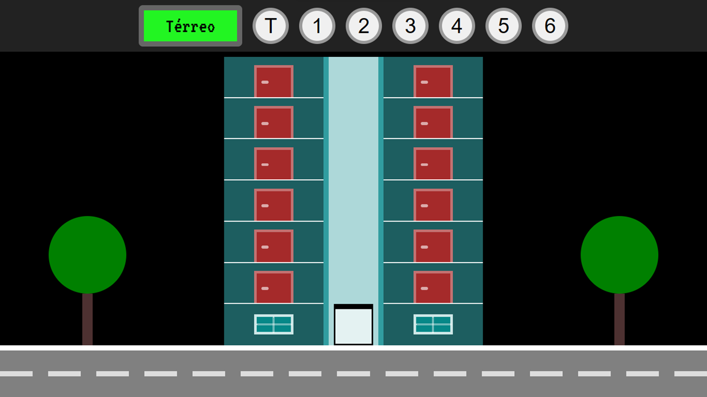
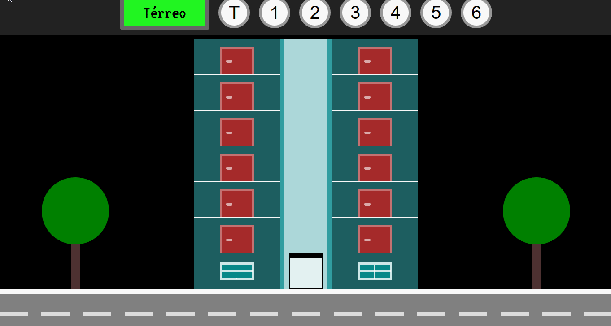

# Elevador

</img>
</img>

## 🤔 O que é este projeto
Este projeto é uma página feita com HTML, CSS e Javascript que contém sete botões de indicação de andares do “T” até 6º andar. Quando clicado o elevador vai para seu respectivo andar. Ainda possui um mostrador ao lado que informa literalmente qual o andar o elevador se encontra. Este foi o primeiro projeto do curso Formação DEV.

## 🖥️ Como rodar este projeto
Para rodar o projeto basta dar dois cliques no arquivo *index.html* uma vez que a pasta do projeto esteja aberta no sistema de arquivos do seu sistema operacional.

Alternativamente você também pode utilizar a extensão [Live Server](https://marketplace.visualstudio.com/items?itemName=ritwickdey.LiveServer) da IDE Visual Studio Code para rodar o projeto.

## 🕹️ Como usar este projeto
Uma vez que a aplicação esteja rodando, você pode clicar nos círculos que representam os andares que são mostrados no topo da página para subir e descer o elevador do edifício conforme desejar. Para mostrar o respectivo andar existe um mostrador retangular ao lado dos círculos que representam os andares.

## ⚙️ Tecnologias usadas no projeto
- 
- 
- 

## 🗒️ Features do projeto
<!-- caracteristicas do projeto resumidas mas não é necessaria-->
- 7 botões que representam os andares para subir e descer o elevador e também alterar o mostrador  ao lado.
- O mostrador indica o andar onde o elevador se encontra parado.

## 🗂️ Como este projeto está organizado
<!-- dar uma ideais geral nãoprecisa ser detalhista -->
Na pasta raiz do projeto existem três arquivos de código:
- index.html -> contém o html da aplicação
- Pasta CSS -> contém o arquivo "style.css" que faz estilos da aplicação
- Pasta js -> contém dois arquivos "rua.js" e "predio.js", códigos javascript da aplicação

## 👩‍💻 Como este projeto foi implementado
<!-- Aqui pode ser usado uma linguagem, mas técnica e não escrever demais-->
Este projeto foi implementado com HTML, CSS e JavaScript.

Na pasta javascript especificamente no arquivo “rua.js” usei uma função para construir as faixas da rua obtendo a quantidade das faixas pelo querySelectorAll e criando cada faixa pelo createElement.

Já no arquivo “predio.js” se concentrou toda a construção do prédio, pavimentos e elevador, como também a movimentação do elevador. Para criação de cada andar, térreo e elevador usei o createElement criando uma “div” que representa cada elemento.

A movimentação do elevador se dá capturando o clique do botão do mouse pelo "onclick" nos respectivos botões é disparado um evento que irá movimentar o elevador conforme andar escolhido e por conseguinte mostrar seu ponto final no mostrador.

## ⭐ Dependências principais
<!-- API's importantes-->
Não existe dependências no projeto.

## 🆘 Precisa de ajuda?
Você pode me contatar através desses contatos:

-------

Feito com 🧑‍💻 por Marcelo

